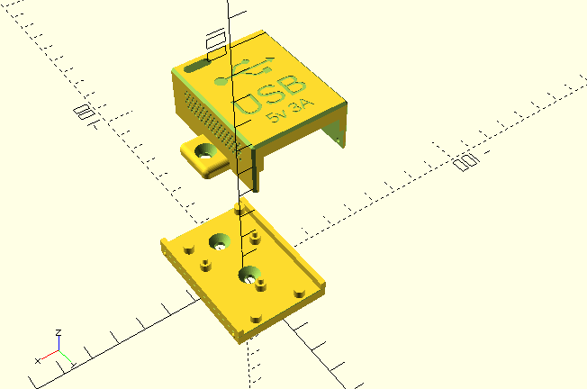
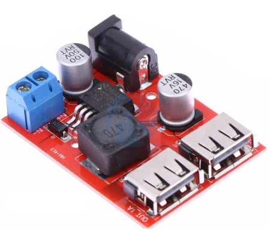
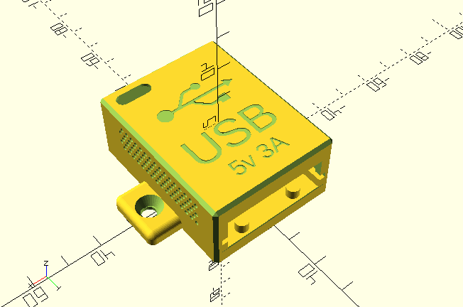

# 3D model enclosure for  LM2596 

This [OpenSCAD](https://openscad.org/) project defines the shape of designs for a 3D model of an enclosure box to protect the component.

## LM2596: Double USB 3A output DC to DC 5v buck converter

Compact DC Voltage Step-Down converter with 2 x USB ports, supports a wide
range of input voltage. 5v at 3A max output.

- DC Input: 6V - 40V
- DC Output: 5V / 3A (MAX)(With Identification resistance for Apple)

### About the LM2596

- Efficiency: 92% (MAX)
- Switching frequency: 150KHZ
- Working temperature: -40 ° - + 85 °
- Load capacity: Maximum output 3A (Connect with two phones simultaneously)
- Scope: mobile power, mobile phones, flat-panel powered devices USB5V
- Product Size: approx. 50 x 35 x 12 mm / 1.96 x 1.37 x 0.47 inches
- Net weight: approx. 17g

## Enclosure Variants

### 1. Compact Enclosure

Source code: [LM2596-enclosure-compact.scad](./LM2596-enclosure-compact.scad)
