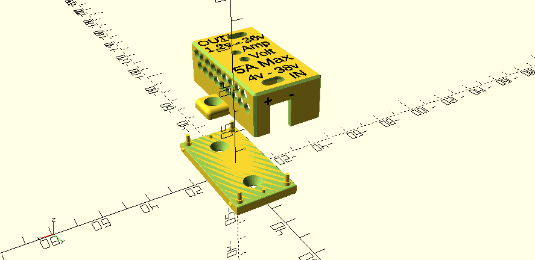
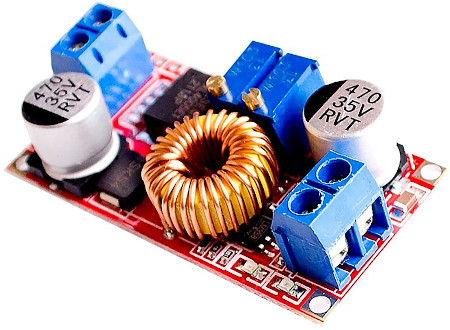
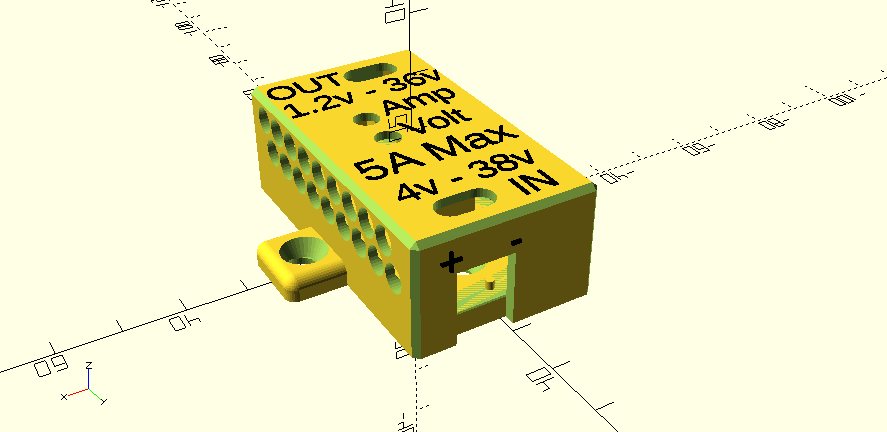

# 3D model enclosure for XL4015

This [OpenSCAD](https://openscad.org/) project defines the shape of designs for a 3D model of an enclosure box to protect the component.

## XL4015: Constant Current & Constant Voltage Step down DC-DC Converter

Very versatile low cost DC to DC buck Converter. CONSTANT CURRENT & CONSTANT VOLTAGE This type of device is another game changer for Electronics DIYers.

- DC Input Range:  4 - 38v
- DC Output Range: 1.2 - 36v, 5A

## Enclosure Variants

### 1. Compact Enclosure

[./XL4015-enclosure-compact.scad]()
