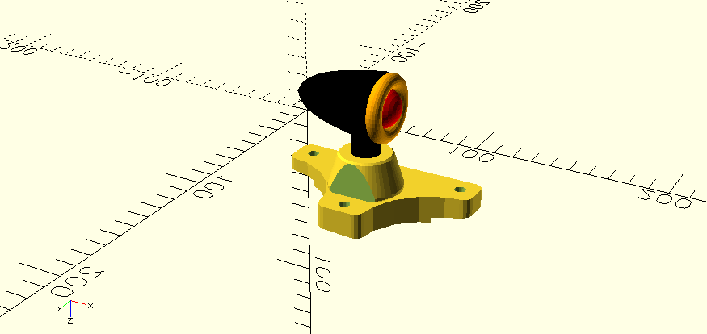

# OpenSCAD Projects

## Enclosure for XL4015

Constant Current & Constant Voltage Step down DC-DC Converter 
[Read More >>](./Electronics%20Protective%20Cases/XL4015/README.MD)

XL4015: Very versatile low cost DC to DC buck Converter. CONSTANT CURRENT & CONSTANT VOLTAGE This type of device is another game changer for Electronics DIYers.

- DC Input Range:  4 - 38v
- DC Output Range: 1.2 - 36v, 5A

## Enclosure for LM2596

Double USB 3A output DC to DC 5v buck converter
[Read More >>](./Electronics%20Protective%20Cases/LM2596/README.MD)

LM2596: Compact DC Voltage Step-Down converter with 2 x USB ports, supports a wide
range of input voltage. 5v at 3A max output.

- DC Input: 6V - 40V
- DC Output: 5V / 3A (MAX)(With Identification resistance for Apple)

## XTR-Street 2 LED Mount

Custom mount for rear-facing LED lights on Blade-Z XTR Street II e-scooter
[Read More >>](./Vehicles/BladeZ/XTR-Street2/README.md)

This OpenSCAD design provides a mount that offsets the LED light from the chassis and straightens its alignment, fitting seamlessly with the scooter's wheel guard.

- Compatible with Blade-Z XTR Street II
- Reuses existing M6 holes from wheel guard
- Customizable for left or right side mounting

