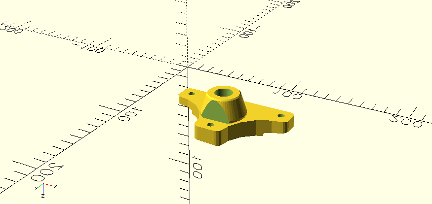
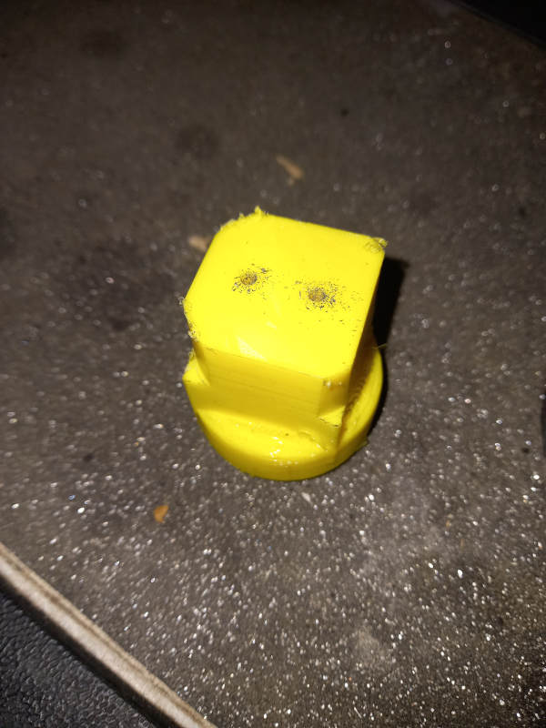
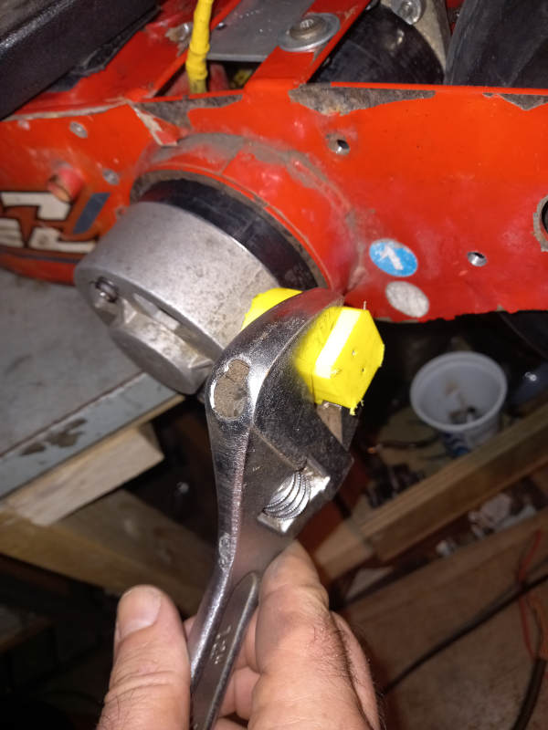

# BladeZ Projects

## Overview

This folder contains 3D printable OpenSCAD designs for BladeZ electric scooters, specifically for the XTR-Street2 model.

### Projects

- [Rear Side Lamp Mount](#rear-side-lamp-mount)
- [Motor Brush Cap Removal Tool](#motor-brush-cap-removal-tool)

## Rear Side Lamp Mount

### Description

Custom mount for rear-facing LED lights on the Blade-Z XTR Street II e-scooter. Offsets the light from the chassis, straightens alignment, reuses existing wheel guard holes, and requires one additional M6 hole.

### Features

- Left or right side mounting
- Print parts separately or together (reduces supports)
- LED lamp preview for alignment
- Reuses M6 wheel guard holes
- One additional M6 securing hole

### Usage

1. Open [`bladez-rear-side-lamp-mount.scad`](bladez-rear-side-lamp-mount.scad) in OpenSCAD.
2. Set `left_or_right` to `"left"` or `"right"`.
3. Adjust `show_*` variables:
   - `show_mount_plate = 1;`
   - `show_shaft_support = 1;`
   - `show_lamp = 1;`
   - `show_shaft_joiner = 0;`
4. Render (F6), export STL.
5. Print and assemble (glue with joiner if separate).

### Dimensions

- Width: 106mm
- Height: 60mm
- Thickness: 35mm
- Holes: M6 (6mm), spacing 87mm (top holes)

### Renders & Prints

- [`bladez-rear-side-lamp-mount.stl`](Renders/bladez-rear-side-lamp-mount.stl)
- Left plate: [`bladez-rear-side-lamp-mount-plate-left.stl`](Renders/bladez-rear-side-lamp-mount-plate-left.stl)
- Right plate: [`bladez-rear-side-lamp-mount-plate-right.stl`](Renders/bladez-rear-side-lamp-mount-plate-right.stl)
- Shaft joiner: [`bladez-rear-side-lamp-mount-shaft-joiner.stl`](Renders/bladez-rear-side-lamp-mount-shaft-joiner.stl)
- Support shaft: [`bladez-rear-side-lamp-mount-support-shaft.stl`](Renders/bladez-rear-side-lamp-mount-support-shaft.stl)

## Motor Brush Cap Removal Tool

### Description

Specialized tool to safely remove motor brush caps on BladeZ scooters for maintenance access without damage.

### Usage

1. Open [`motor-brush-cap-remover.scad`](motor-brush-cap-remover.scad) in OpenSCAD.
2. Render (F6), export [`motor-brush-cap-remover.stl`](Renders/motor-brush-cap-remover.stl).
3. 3D print the tool.

### Demo

[Motor Brush Removal Tool Demo](Photos/BladeZ%20Motor%20Brush%20Removal%20Tool_crushed_85pc.mp4)

## Requirements

- OpenSCAD (2021.01+ recommended)
- 3D printer

## Customization

Both SCAD files have parameters at the top for adjustments.

## Author

Anthony Gallon, Owner/Licensor: AntzCode Ltd <https://www.antzcode.com>, Contact: https://github.com/AntzCode

## License

[GNU General Public License v3.0](LICENSE/../../LICENSE)

## Repository

[GitHub](https://github.com/AntzCode/OpenSCAD-Projects)